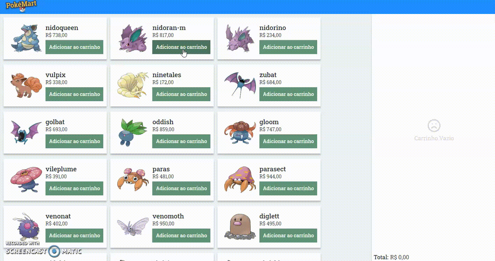

## PokéMart
* Uma pequena aplicação com funcionalidades de listar pokémons, adicionar itens ao carrinho e finalizar compra.
Essa aplicação utiliza a api https://pokeapi.co/ para listagem dos pokemons.

Para começar a utilizar o projeto apenas baixe ou clone e dê **yarn**

* Preview do projeto

